#### Proyecto fastapi con docker-compose 

# Consideraciones iniciales
Tener en cuenta que si se ejecuta cualquiera api de PlaceHolder Api esta eliminara todos los registros de la tabla para volverlos a cargar
y a su vez si tienen referencia en otras tabla ese id , se eliminara ya que esta en cascade.

## Correr proyecto con docker-compose

    docker-compose up --build

    Cuando ya todo este corriendo entrar al contendor que corre la aplicacion de fastapi con el siguiente comando
        docker exec -it --user root d6fd6c557b52 /bin/bash
   
   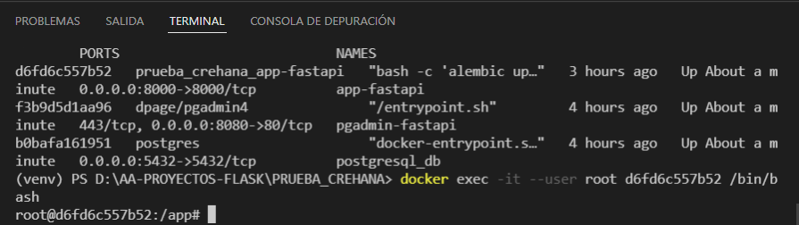

    y luego ejecutar

    alembic revision --autogenerate -m 'crear modelos'
    alembic upgrade heads
   
   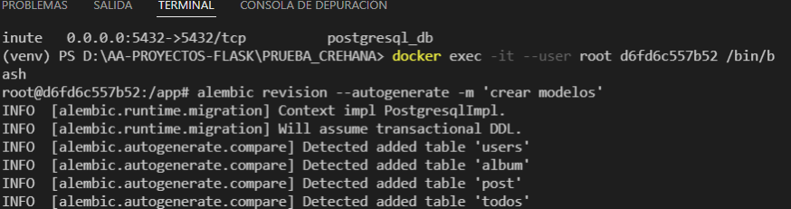
    por ultimo salir del contenedor

    exit
    
    Validar en pgadmin si se realizaron las migraciones
   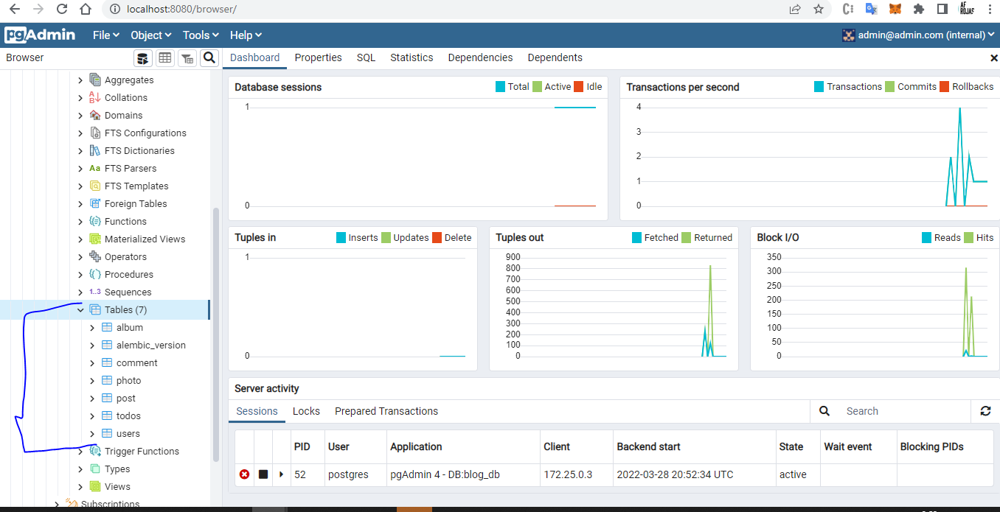
    
    Importante:
        Si desea hacer cambios en los modelos antes de volver a realizar las migraciones debe de eliminar la tabla alembic de la base de datos y luego si realizar la migracion correspondiente.
        
        
        
## Conexion pgadmin 
   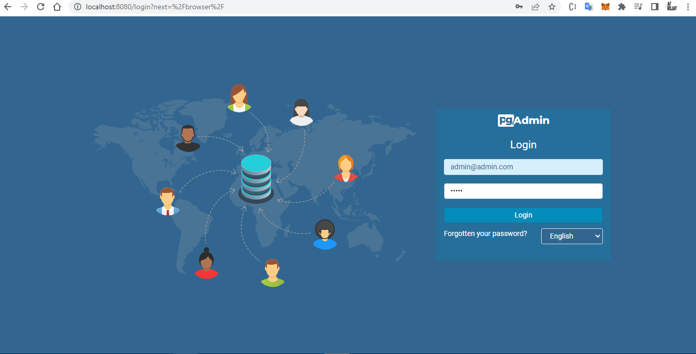
   
   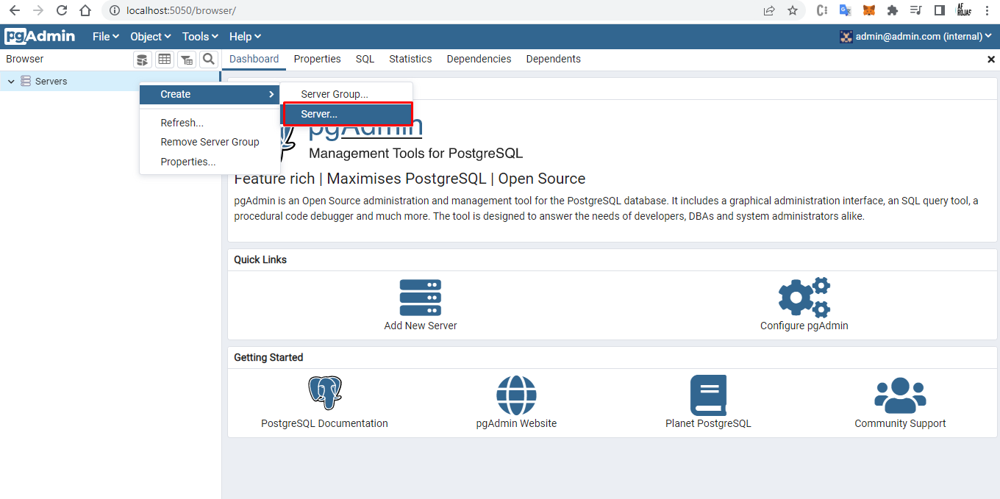

   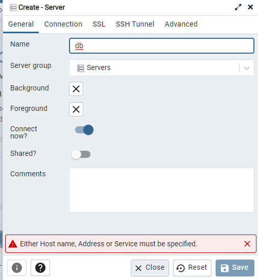

   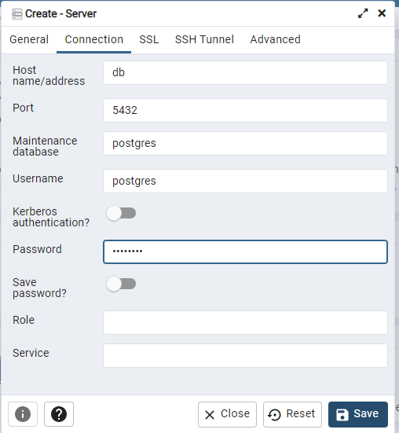

## Apis en graphql

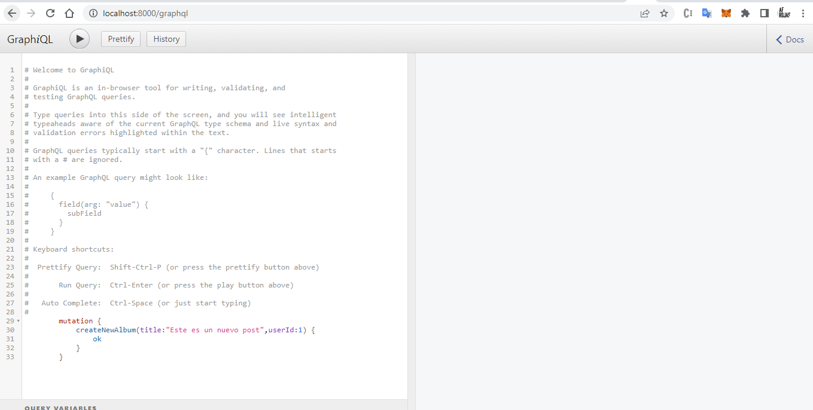

graphql
    http://localhost:8000/graphql
    
    mutacion crear post ejemplo :
        mutation CreateNewPost{
            createNewPost(title:"Este es un nuevo post", body:"nuevo post",userId:1) {
                ok
            }
        }
    
    Mutacion crear album:
        mutation {
            createNewAlbum(title:"Este es un nuevo post",userId:1) {
                ok
            }
        }
    query todos los post ejemplo:
        query{
            allPosts{
                title
            }
        }
    query trae todos los albums:           
        query{
            allAlbums{
                title
                id
            }
        }

resolve_ -> al inicio de una query es importante porque es lo que va a devolver

## Ejecutar test 
    
    Para ejecutar las pruebas debe de tener una base de datos(postgres) local
    y comentar la linea 11 y 12 del archivo database.py y descomentar la linea 16 del mismo archivo
    estar en la carpeta app y ejecutar
    - pytest test_api.py
    - pytest test_graphql.py
    o
    pytest

    O ejecutar

    coverage run -m pytest 
    
   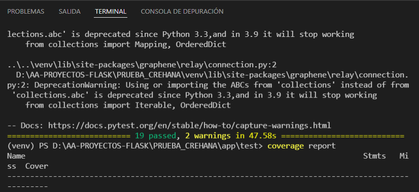
    
    En el caso de que quiera colocar print dentro de las funciones de test ejecutar :
        coverage run -m pytest -s 
        
   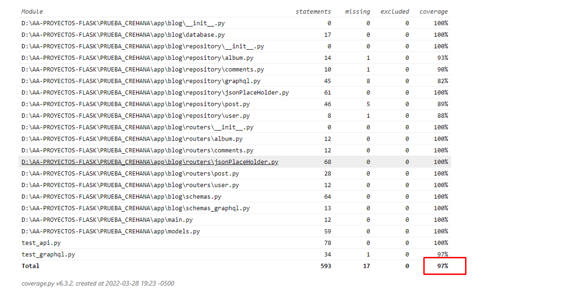
    
   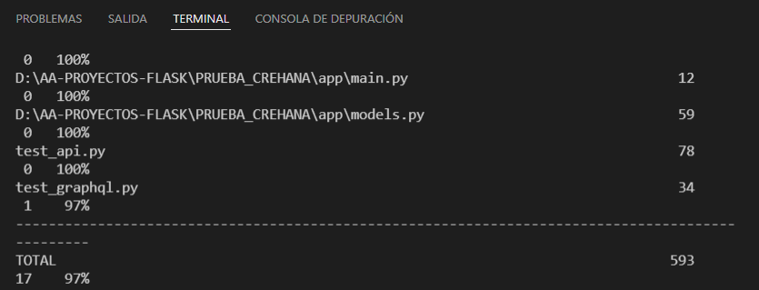
    
    
    Si ejecuta por medio del coverage puede ejecutar tambien coverage report
    para ver que parte del codigo esta evaluando y ejecute coverage html para ver en html que partes del codigo evaluo y que partes faltan por evaluar

    Tener en cuenta que cuando se ejecuta el test test_graphql.py al menos las tablas de las base de datos deben de estar llenas
    
## Eliminar todas las imágenes de docker
    docker rmi $(docker images -q)

## Eliminar todos los contenedores de docker
    docker rm $(docker ps -a -q)

## Iniciar el proyecto localmente

    Primero debe de crear su entorno virtual con
        virtualenv venv
    Activar el entorno virtual
        .\venv\Scripts\activate.ps1
    Instalar las librerias correspondientes
        pip install -r requirments.txt
    
    Luego debe de ejecutar las migraciones en su base de datos local para ello debe de eliminar la carpeta de alembic que esta dentro de la carpeta app y ejecutar
    
    alembic init alembic

    Luego de ello debe de tener en cuenta el alembic.ini ya que debe de modificarlo para que agarre su base de datos local, asimismo como su env.py

    modificiar el alembic.ini
    
    Luego ejecutar :
        alembic revision --autogenerate -m 'crear modelos'
        alembic upgrade heads
    Y esto aplicara las migraciones correspondiente

    Luego de ello puede ejecutar 
        Ejecutar app (entrar a la carpeta app ):
        uvicorn main:app --reload
    

El porque de las carpetas:   
    La carpeta repository se encarga de las consultas
    La carpeta routers se encarga de las rutas de la api

## Apis creadas

    Para ver las apis creadas solo entre al navegador a http://localhost:8000/docs

## autopep8
    - autopep8 --in-place --aggressive --aggressive <filename>
    autopep8 --in-place --aggressive --aggressive models.py

### Funcion create_todo 
    se penso consumir la api pero ese proceso tardaba mucho por eso se llamo a la funcion y el tiempo disminuia
